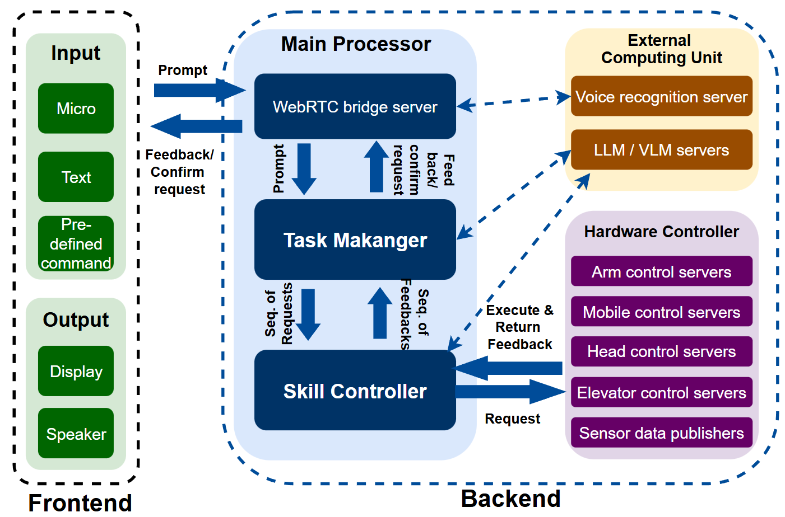

==========
Overview
==========

Introduction
-----------------

This work develops a Mobile Assistive Robotic System (MARS) designed to assist people with disabilities by performing daily tasks such as retrieving objects and helping meal. MARS uses ROS2 framework to connect 
a 7-DOF robotic arm, hybrid gripper, RGB-depth cameras, and a large language model-based planner, enabling intergration of vision-based recognition, skill affordance, and natural language task planning. 
Through real-world experiments in cluttered environments, MARS provides a promising solution for autonomous assistive robots in dynamic home settings.

.. figure:: images/fig_testbed.png
   :alt: Alternative text
   :width: 600px
   :align: center

   Real-world use of a mobile assistive robot. (a) 7-DOF robotic arm on a two-wheeled base. (b) Sweeping water. (c) Picking and placing items.

System Overview
-----------------

   Care Robot testbed.

To ensure modularity and seamless integration of various functionalities, the robot operates within a ROS2-based framework, as shown in the figure. 
The system includes:

    - **Human-Robot Interaction (HRI) Module**: Permitting natural language communication, allowing users requesting and receiving updated feedback via text or voice input.
    - **Task Planning Module**: Powered by a large language model (LLM), this module interprets text and voice commands into structured execution plans.
    - **Task Manager**: Determines the appropriate execution strategy and coordinates with the perception and manipulation modules, assigning tasks to their corresponding execution modules.
    -  **Perception Module**: Utilizing advanced vision-language models (VLMs), such as Grounding DINO and FastSAM, for object detection, segmentation, and affordance-based grasping.
    - **Robot Manipulation Module**: Performing movement, grasping, and placement, enabling efficient object handling and assistance.
    -  **External Computing Unit**: A powerful device running resource-intensive VLM/LLM functions (e.g., Grounding DINO, FastSAM, and LLM) as a TCP/IP server, providing real-time outputs in response to requests from the task planner and perception modules.
    -  **Depth Camera System**: Two RGB-depth cameras provide visual perception, with the head camera used for scene understanding and the wrist camera for fine-grained object interaction.

SDK Overview 
-----------------

1. Installation: see the :ref:`install` section for more details.

2. Task-based packages

To reduce the complexity and time consumming while repeatdly coding  callback function or handle different kinds of connections, 
we developed task-based pakages that aids the easy implementation of the system. The packages inludes:

 -  pyconnect: Enables repeated communication between nodes and functionality PCs with easy ROS node setup and message logging. 

 - pyrecognition: Implements popular recognition functions (e.g., grasp detection, object detection, instance segmentation, VLM)

 - carerobotapp: ROS2 Nodes Implementation

 - pyinterfaces: Represents frequently used terms and utilities (e.g., instances, masks, boxes, grasp pose, place pose)

 - rosinterfaces: ROS2 Data Interfaces

3. Manual: see the :ref:`manual` section for more details.

4. Examples: see the :ref:`examples` section for more details.
 

